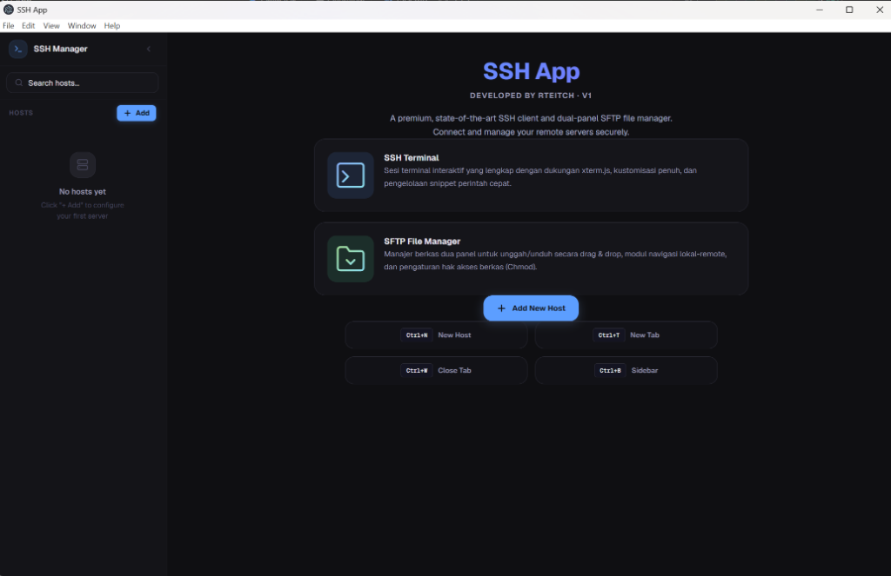
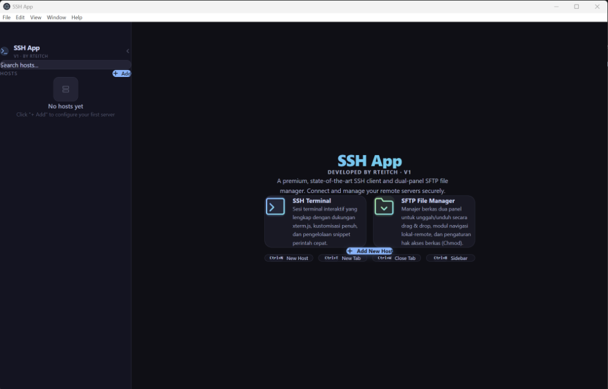

# SSH App

A modern, premium SSH desktop client with a dual-panel SFTP file manager — built with Electron, React, TypeScript, and xterm.js.

**Developed by Rteitch** · Version 1.0

---

## Screenshots

<div align="center">
  
  <p><em>Premium Welcome Screen featuring dual SSH Terminal & SFTP Feature Cards</em></p>
</div>

<div align="center">
  
  <p><em>Revamped Add Host Modal with responsive inputs and no-wrap spacing</em></p>
</div>

---

## Tech Stack

| Layer | Library | Version |
|---|---|---|
| Desktop | Electron | 28.x |
| UI | React + TypeScript | 19.x |
| Styling | Tailwind CSS | 4.x |
| Terminal | xterm.js | 6.x |
| SSH & SFTP | ssh2 | 1.x |
| Database | better-sqlite3 | 12.x |
| Credential | electron.safeStorage | Built-in |
| Bundler | electron-vite + Vite | 5.x / 7.x |

---

## Features

### SSH Terminal
- Full terminal emulator via **xterm.js** with ANSI 256-color support
- **Multi-tab sessions** — connect to multiple servers simultaneously
- Automatic terminal resize, scroll buffer, and search (`Ctrl+F`)
- Clickable web links in terminal output
- **Snippet Manager** — save, tag, and one-click execute frequently used commands

### SFTP File Manager (Dual-Panel)
- Side-by-side **Local ↔ Remote** file browser within each connection tab
- Switch between **Terminal** and **SFTP** views using the tab bar toggle
- Full file operations: upload, download, rename, delete, mkdir, chmod
- **Drag & Drop** files between Local and Remote panels
- Real-time **transfer progress queue** with percentage tracking
- **Hidden files toggle** (dotfiles) on both panels
- **Column sorting** (name, size, date) on both panels
- **Chmod permission editor** — interactive checkbox UI (rwx) with computed octal display
- **Destructive action confirmations** — delete operations require explicit confirmation

### Host Management
- Save, edit, and delete SSH hosts stored in local SQLite database
- Organize hosts into **groups/folders**
- Instant **search** across all hosts in the sidebar
- **Quick Connect** from the welcome screen

### Security
- Passwords and passphrases encrypted via `electron.safeStorage` (macOS Keychain / Windows DPAPI / Linux Secret Service)
- `contextIsolation: true` — renderer process cannot access Node.js APIs directly
- All local filesystem operations use **`path.resolve()`** to prevent path traversal attacks
- Root and home directory deletion blocked as a safety measure

### UI/UX
- **Catppuccin Mocha** dark theme with curated, harmonious colors
- macOS native feel — hidden titlebar, vibrancy, traffic lights integration
- Windows-compatible layout with proper window controls
- Collapsible sidebar (`Ctrl+B`)
- Smooth micro-animations and hover effects
- Glassmorphic modal overlays (performance-aware: `backdrop-filter` only on static elements)
- Snippet drawer sliding panel for quick command execution

---

## Keyboard Shortcuts

| Shortcut | Action |
|---|---|
| `Ctrl+N` | Add new host |
| `Ctrl+B` | Toggle sidebar |
| `Ctrl+T` | New tab (when connected) |
| `Ctrl+W` | Close current tab |

---

## Installation Guide

### Prerequisites

| Requirement | Minimum Version |
|---|---|
| **Node.js** | 18.x or later |
| **npm** | 9.x or later |
| **Python** | 3.x (required for building native modules) |
| **C++ Build Tools** | See platform-specific instructions below |

### Windows 10/11

1. **Install Node.js**

   Download and install from [nodejs.org](https://nodejs.org/) (LTS recommended).

2. **Install Windows Build Tools**

   Native modules (`better-sqlite3`, `ssh2`) require C++ compilation. Open **PowerShell as Administrator** and run:

   ```powershell
   npm install -g windows-build-tools
   ```

   Alternatively, install **Visual Studio Build Tools** manually:
   - Download from [Visual Studio Downloads](https://visualstudio.microsoft.com/downloads/)
   - Select "Desktop development with C++" workload
   - Ensure "Windows 10/11 SDK" is checked

3. **Clone & Install**

   ```powershell
   git clone https://github.com/rteitch/ssh-app.git
   cd ssh-app
   npm install
   ```

   The `postinstall` script will automatically run `electron-rebuild` to compile native modules for Electron.

4. **Run Development Server**

   ```powershell
   npm run dev
   ```

5. **Build for Production**

   ```powershell
   npm run build
   npm run preview
   ```

### macOS (Apple Silicon M1/M2/M3/M4 & Intel)

1. **Install Xcode Command Line Tools**

   ```bash
   xcode-select --install
   ```

2. **Install Node.js**

   Using Homebrew (recommended for Apple Silicon):

   ```bash
   brew install node
   ```

   Or download from [nodejs.org](https://nodejs.org/).

3. **Clone & Install**

   ```bash
   git clone https://github.com/rteitch/ssh-app.git
   cd ssh-app
   npm install
   ```

   > **Apple Silicon Note:** `better-sqlite3` and `ssh2` will compile natively for ARM64 during `npm install` via the `electron-rebuild` postinstall script. If you encounter build errors, ensure you are using the ARM64 version of Node.js (not the x64 Rosetta version). Verify with:
   >
   > ```bash
   > node -p "process.arch"
   > # Should output: arm64
   > ```

4. **Run Development Server**

   ```bash
   npm run dev
   ```

5. **Build for Production**

   ```bash
   npm run build
   npm run preview
   ```

### Linux (Ubuntu/Debian)

1. **Install Dependencies**

   ```bash
   sudo apt update
   sudo apt install -y build-essential python3 libsecret-1-dev
   curl -fsSL https://deb.nodesource.com/setup_20.x | sudo -E bash -
   sudo apt install -y nodejs
   ```

2. **Clone & Install**

   ```bash
   git clone https://github.com/rteitch/ssh-app.git
   cd ssh-app
   npm install
   ```

3. **Run Development Server**

   ```bash
   npm run dev
   ```

---

## Troubleshooting

### `electron-rebuild` Fails on Windows

If you see `gyp ERR!` errors during install:

```powershell
# Ensure Python 3 and VS Build Tools are installed
npm config set msvs_version 2022
npm install
```

### `better-sqlite3` Build Error on Apple Silicon

```bash
# Clean and rebuild
rm -rf node_modules
npm install
# If still failing, try:
npm rebuild better-sqlite3 --build-from-source
```

### `ssh2` Build Warning

`ssh2` may show optional dependency warnings for `cpu-features`. This is safe to ignore — the module works without it.

### Application Shows Blank Screen

Ensure you are running `npm run dev` (not `npm start` directly). The dev server needs to compile the renderer first.

---

## Project Structure

```
ssh-app/
├── electron/                    ← Main process (Node.js)
│   ├── main.ts                  ← Entry point, IPC handlers, window config
│   ├── preload.ts               ← contextBridge API (renderer ↔ main)
│   ├── ssh/
│   │   ├── sshManager.ts        ← SSH connection & shell management
│   │   └── sftpManager.ts       ← SFTP file operations
│   ├── db/
│   │   ├── database.ts          ← SQLite schema & initialization
│   │   ├── hostRepository.ts    ← CRUD for SSH hosts
│   │   └── snippetRepository.ts ← CRUD for command snippets
│   └── security/
│       └── credentialStore.ts   ← safeStorage encrypt/decrypt
├── src/                         ← Renderer (React)
│   ├── App.tsx                  ← Main layout, state management, snippet drawer
│   ├── main.tsx                 ← React entry point
│   ├── components/
│   │   ├── Sidebar/
│   │   │   └── Sidebar.tsx      ← Host list, search, groups, context menu
│   │   ├── Terminal/
│   │   │   ├── TabBar.tsx       ← Multi-tab bar with Terminal/SFTP view toggle
│   │   │   └── TerminalTab.tsx  ← xterm.js terminal wrapper
│   │   ├── SFTP/
│   │   │   ├── SftpManager.tsx  ← Dual-panel orchestrator & transfer queue
│   │   │   ├── LocalPanel.tsx   ← Local file browser panel
│   │   │   └── RemotePanel.tsx  ← Remote SFTP browser panel
│   │   └── Modals/
│   │       └── AddHostModal.tsx ← Add/edit host form
│   ├── styles/
│   │   └── index.css            ← Global styles, CSS variables, animations
│   └── types/
│       ├── index.ts             ← TypeScript interfaces
│       └── css.d.ts             ← CSS module type declarations
├── index.html                   ← HTML entry point
├── package.json
├── electron.vite.config.ts      ← electron-vite build configuration
├── tailwind.config.js           ← Tailwind CSS v4 config
├── postcss.config.js            ← PostCSS config
└── tsconfig.json                ← TypeScript config
```

---

## Architecture

```
┌─────────────────────────────────────────────────────────┐
│                    ELECTRON MAIN PROCESS                │
│                                                         │
│  ┌─────────────┐  ┌──────────────┐  ┌───────────────┐  │
│  │  sshManager │  │  sftpManager │  │  hostDatabase │  │
│  │  (ssh2)     │  │  (ssh2/sftp) │  │  (SQLite)     │  │
│  └──────┬──────┘  └──────┬───────┘  └───────┬───────┘  │
│         └────────────────┴──────────────────┘           │
│                          │ IPC                          │
│                    preload.ts (bridge)                  │
│  ┌─────────────────────────────────────────────────┐    │
│  │  Local File System API (fs:listLocal, etc.)     │    │
│  │  Path sanitized via path.resolve()              │    │
│  └─────────────────────────────────────────────────┘    │
└──────────────────────────┼──────────────────────────────┘
                           │
┌──────────────────────────┼──────────────────────────────┐
│                  ELECTRON RENDERER (React)               │
│                                                         │
│  ┌──────────┐  ┌──────────────────┐  ┌───────────────┐  │
│  │ Sidebar  │  │  Terminal / SFTP  │  │ Snippet Drawer│  │
│  │ (hosts)  │  │  (view toggle)   │  │ (commands)    │  │
│  └──────────┘  └──────────────────┘  └───────────────┘  │
│                ┌──────────────────────┐                  │
│                │  Transfer Queue Bar  │                  │
│                └──────────────────────┘                  │
└─────────────────────────────────────────────────────────┘
```

---

## Color Theme (Catppuccin Mocha)

| Variable | Color | Usage |
|---|---|---|
| `--bg-primary` | `#1e1e2e` | Main background |
| `--bg-secondary` | `#181825` | Sidebar, status bar |
| `--bg-surface` | `#313244` | Cards, inputs, hover states |
| `--accent` | `#89b4fa` | Primary accent (blue) |
| `--success` | `#a6e3a1` | Online status, connect buttons |
| `--error` | `#f38ba8` | Errors, close, delete actions |
| `--warning` | `#f9e2af` | Warning indicators |
| `--text-primary` | `#cdd6f4` | Primary text |
| `--text-muted` | `#585b70` | Secondary/muted text |

---

## License

MIT
